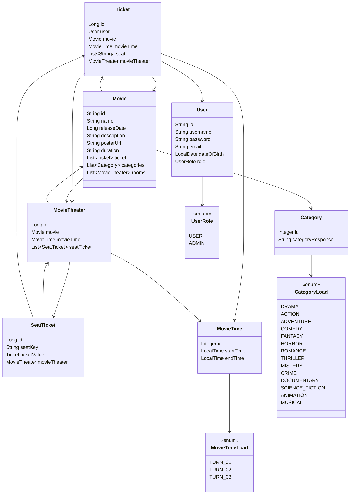

<h1 align="center">🎬 Movie Reservation System 🎟️</h1>

The service will allow users to register, login, manage films, reserve seats for specific show times and manage their seat reservations. The system includes user authorization and authentication, management of films and show times, seat reservation functionality, with exception handling and automated testing with JUnit for all functions.

# 💻 Tecnologies

- Java 21
- Maven
- Spring Boot 3.4.3
- JPA + Hibernate
- JWT
- Spring Security
- Lombok
- PostgreSQL

# 🧩 Class Diagram



# 🔗 API Endpoints

| Method  | Endpoint                | Description                                   | Access        |
|---------|-------------------------|-----------------------------------------------|---------------|
| `POST`  | `/movies/create`        | Create a new movie                          | Admin         |
| `GET`   | `/movies`               | List all movies                             | Public        |
| `GET`   | `/movies/`              | Get information about a movie               | User          |
| `PUT`   | `/movies/update`        | Update a movie                              | Admin         |
| `DELETE`| `/movies`               | Remove all movies                           | Admin         |
| `DELETE`| `/movies/`              | Remove a movie                              | Admin         |
| `POST`  | `/ticket`               | Create a new ticket                         | User          |
| `PUT`   | `/ticket`               | Update a ticket                             | User          |
| `GET`   | `/ticket`               | List all tickets                            | Admin         |
| `GET`   | `/ticket/`              | Get information about a ticket              | Admin         |
| `DELETE`| `/ticket/`              | Remove a ticket                             | Admin         |
| `DELETE`| `/ticket`               | Remove all tickets                          | Admin         |
| `POST`  | `/auth/login`           | Authenticate user                           | Public        |
| `POST`  | `/auth/register`        | Register user                               | Public        |
| `PUT`   | `/user`                 | Update user information                     | Admin         |
| `GET`   | `/user`                 | List all users                              | Admin         |
| `GET`   | `/user/`                | Get information about a user                | Admin         |
| `DELETE`| `/user`                 | Remove all users                            | Admin         |
| `DELETE`| `/user/`                | Remove a user                               | Admin         |


# ✅ Unit Tests

### Implemented Tests

The system includes a series of unit and integration tests to ensure the correct functioning of its features. Below are the test classes:

### Controller Layer Tests
- `AuthControllerLayerTest.java` — Tests for the Authentication Controller.
- `MovieControllerLayerTest.java` — Tests for the Movie Controller.
- `TicketControllerLayerTest.java` — Tests for the Ticket Controller.
- `UserControllerLayerTest.java` — Tests for the User Controller.

### Service Layer Tests
- `AuthServiceLayerTest.java` — Tests for the Authentication Service.
- `MovieServiceLayerTest.java` — Tests for the Movie Service.
- `MovieTheaterServiceLayerTest.java` — Tests for the MovieTheater service.
- `SeatTicketServiceLayerTest.java` — Tests for the SeatTicket service.
- `TicketServiceLayerTest.java` — Tests for the Ticket Service.
- `UserServiceLayerTest.java` — Tests for the User Service.

### Repository Layer Tests
- `MovieRepositoryLayerTest.java` — Tests for the Movie Repository.
- `MovieTheaterRepositoryLayerTest.java` — Tests against the MovieTheater Repository.
- `TicketRepositoryLayerTest.java` — Tests against the Ticket Repository.
- `UserRepositoryLayerTest.java` — Tests for the User Repository.

## ⚙️Installation

1. Clone the repository:

```bash
git clone https://github.com/lsfelipedev/Movie-Reservation-System.git
```

2. Install dependencies with Maven

3. Install [PostgresSQL](https://www.postgresql.org/)

## 🚀 Usage

1. Start the application with Maven
2. The API will be accessible at http://localhost:8080
